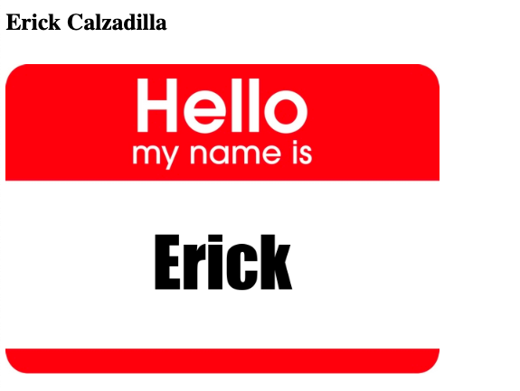

# erickcp15.github.io

## This repository was created so that I may host my html pages on github.

Input: erickcp15.github.io into your url to see host site on github

Or try: erickcp15.github.io/Ex.html to see basic hosted github example I made when first creating github sites

